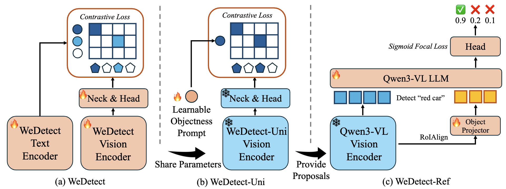
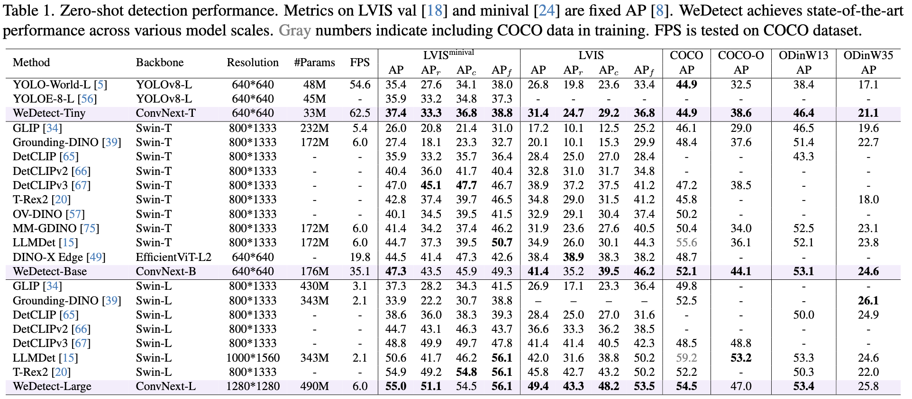
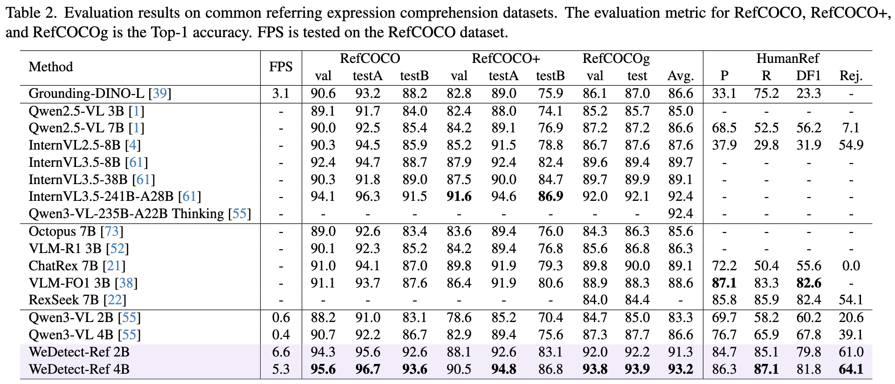
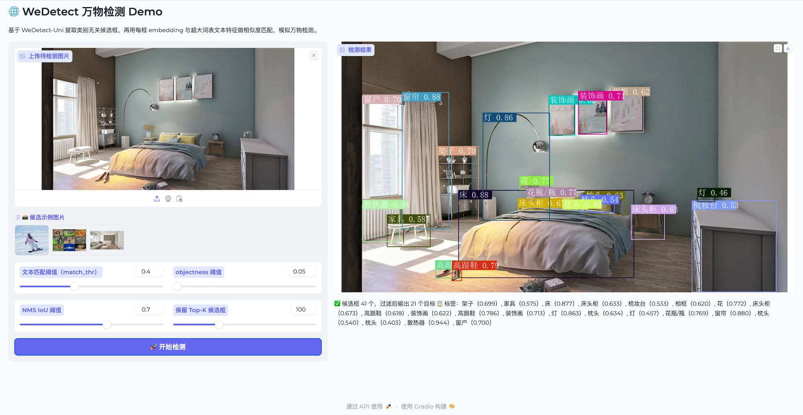
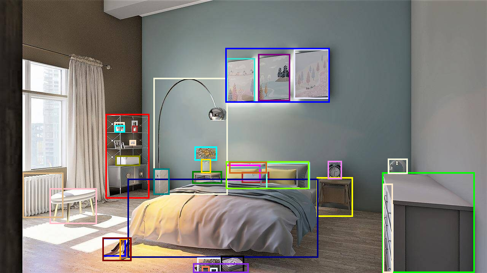

# WeDetect: Fast Open-Vocabulary Object Detection as Retrieval

This is the official PyTorch implementation of WeDetect. Our paper can be found at [here](https://arxiv.org/abs/2512.12309).

If you find our work helpful, please kindly give us a star 🌟

Here is the [中文版指南](./README_zh.md).

## 🔥 Update

- [2026.06.07] 🔥🔥🔥 We release `WeDetect-Angthing`, which can automatically detect every object in the given image without any prompt!!! Feel free to try out our demo.
- [2026.06.05] We release the onnx deployment code.
- [2026.02.21] Our paper was accepted by CVPR2026.
- [2026.02.06] We release the WeDetect finetuning code.
- [2026.02.03] We release the first MLLM-based object embedding model [ObjEmbed](https://github.com/WeChatCV/ObjEmbed) based on WeDetect.
- [2025.12.16] Release the inference code and paper.

## 👀 WeDetect Family Overview

<p align="left">
    
</p>

Open-vocabulary object detection aims to detect arbitrary classes via text prompts. Methods without cross-modal fusion layers (non-fusion) offer faster inference by treating recognition as a retrieval problem, \ie, matching regions to text queries in a shared embedding space. In this work, we fully explore this retrieval philosophy and demonstrate its unique advantages in efficiency and versatility through a model family named WeDetect: 
- **State-of-the-art performance.** **WeDetect** is a real-time detector with a dual-tower architecture. We show that, with well-curated data and full training, the non-fusion WeDetect surpasses other fusion models and establishes a strong open-vocabulary foundation. 
- **Fast backtrack of historical data.** **WeDetect-Uni** is a universal proposal generator based on WeDetect. We freeze the entire detector and only finetune an objectness prompt to retrieve generic object proposals across categories. Importantly, the proposal embeddings are class-specific and enable a new application, **object retrieval**, supporting retrieval objects in historical data.
- **Integration with LMMs for referring expression comprehension (REC).** We further propose **WeDetect-Ref**, an LMM-based object classifier to handle complex referring expressions, which retrieves target objects from the proposal list extracted by WeDetect-Uni. It discards next-token prediction and classifies objects in a single forward pass. 

Together, the WeDetect family unifies detection, proposal generation, object retrieval, and REC under a coherent retrieval framework, achieving state-of-the-art performance across 15 benchmarks with high inference efficiency.

## 📈 Experimental Results

#### 📍 Model Zoo

- Please download the models and put them in `checkpoints`.
- WeDetect
  - [WeDetect-Tiny](https://huggingface.co/fushh7/WeDetect)
  - [WeDetect-Base](https://huggingface.co/fushh7/WeDetect)
  - [WeDetect-Large](https://huggingface.co/fushh7/WeDetect)

- WeDetect-Uni
  - [WeDetect-Base-Uni](https://huggingface.co/fushh7/WeDetect)
  - [WeDetect-Large-Uni](https://huggingface.co/fushh7/WeDetect)

- WeDetect-Ref
  - [WeDetect-Ref 2B](https://huggingface.co/fushh7/WeDetect-Ref-2B)
  - [WeDetect-Ref 4B](https://huggingface.co/fushh7/WeDetect-Ref-4B)

#### 📍 Results

<p align="left">
    
</p>
<p align="left">
    
</p>

## 🔧 Install

#### Our environment

```
pytorch==2.5.1+cu124
transformers==4.57.1
trl==0.17.0
accelerate==1.10.0
mmcv==2.1.0
mmdet==3.3.0
mmengine==0.10.7
```

- MMCV series packages are not required for WeDetect-Ref users.
- Install the environment as follows.

```
pip install transformers==4.57.1 trl==0.17.0 accelerate==1.10.0 -i https://mirrors.cloud.tencent.com/pypi/simple
pip install pycocotools terminaltables jsonlines tabulate lvis supervision==0.19.0 webdataset ddd-dataset albumentations -i https://mirrors.cloud.tencent.com/pypi/simple

# WeDetect-Ref users do not need to install following packages
pip install openmim -i https://mirrors.cloud.tencent.com/pypi/simple
mim install mmcv==2.1.0
mim install mmdet==3.3.0
```

- We found that installing `MMCV` can be challenging. Here are some helpful resources to assist with the installation:
  - https://github.com/open-mmlab/mmcv/issues/3303
  - https://github.com/open-mmlab/mmcv/issues/3327
  - https://github.com/open-mmlab/mmcv/issues/3319
- Both `mmcv==2.1.0`, `mmcv==2.2.0` and many other versions of PyTorch are compatible and work well.
- We also provide an inference example code (`deploy/test_coco_pytorch.py`) that does not depend on mmdet. 


## ⭐ Demo

#### 📍 WeDetect-Anything

We provide instructions and gradio demos in the folder `wedetect_anything`. 

<p align="left">
    
</p>

#### 📍 WeDetect
```
python3 infer_wedetect.py --config config/wedetect_large.py --checkpoint checkpoints/wedetect_large.pth --image assets/demo.jpeg --text '鞋,床' --threshold 0.3
```
- Note: WeDetect is a Chinese-language model, so please provide class names in Chinese. The model supports detecting multiple categories simultaneously by separating each class name with an English comma. All characters in the command should be in English, including quotation marks (except for the Chinese class names).

<p align="left">
    
</p>


#### 📍 WeDetect-Uni

```
# output the prediction higher than the threshold
python generate_proposal.py --wedetect_uni_checkpoint /PATH/TO/WEDETECT_UNI --image assets/demo.jpeg --visualize --score_thre 0.2
```
<p align="left">
    
</p>

#### 📍 WeDetect-Ref
```
# output the top1 prediction
python infer_wedetect_ref.py --wedetect_ref_checkpoint /PATH/TO/WEDETECT_REF --wedetect_uni_checkpoint /PATH/TO/WEDETECT_UNI --image assets/demo.jpeg --query "a photo of trees and a river" --visualize

# output the prediction higher than the threshold
python infer_wedetect_ref.py --wedetect_ref_checkpoint /PATH/TO/WEDETECT_REF --wedetect_uni_checkpoint /PATH/TO/WEDETECT_UNI --image assets/demo.jpeg --query "a photo of trees and a river" --visualize --score_thre 0.3
```

- WeDetect-Ref is a multilingual model. You can use either Chinese or English queries for testing, but only one query can be provided at a time.
- Our model is trained with WeDetect-Base-Uni. It is recommended to use the same one during inference.

<p align="left">
    
</p>


## 🔧 Deployment

Please refer to the folder `deploy`.


## 📏 Evaluation
#### 📍 WeDetect
```
# Evaluating WeDetect-Base on COCO
bash dist_test.sh config/wedetect_base.py /PATH/TO/WEDETECT 8
```
- Please change the dataset path in the config.

#### 📍 WeDetect-Uni
```
# Evaluating recall on COCO
cd eval_recall
torchrun --nproc-per-node=8 --nnodes=1 --node_rank=0 --master_addr="127.0.0.1" --master_port=29500 eval_recall.py --wedetect_uni_checkpoint wedetect_base_uni.pth --dataset coco
```
- Please change the dataset path in Line 10 of `eval_recall/eval_recall.py`.
- Dataset can be `coco`, `lvis`, and `paco`.

```
# Evaluating the object retrieval task on COCO

cd eval_retrieval

# extract embedding
torchrun --nproc-per-node=8 --nnodes=1 --node_rank=0 --master_addr="127.0.0.1" --master_port=29500 extract_embedding.py --model wedetect --wedetect_checkpoint wedetect_base.pth --wedetect_uni_checkpoint wedetect_base_uni.pth --dataset coco

# retrieval
python3 retrieval_metric.py --model wedetect --dataset coco --thre 0.2
```
- Please change the dataset path in Line 1323 of `eval_retrieval/extract_embedding.py` and Line 61 of `eval_retrieval/retrieval_metric.py` and Line 82 of `eval_retrieval/retrieval_metric.py`.
- Dataset can be `coco`, and `lvis`.

#### 📍 WeDetect-Ref
- Please refer to the folder `wedetect_ref`.


## 🚀 Finetune WeDetect on a Custom Dataset

- Please origanize your dataset in the COCO format. And provide a classname file in `Chinese` similar to `data/texts/coco_zh_class_texts.json`.
- Below, we use COCO2017 as an example. We finetune WeDetect-Base with 8 GPUs (24G or less is OK), four images per device, and 12 epochs.
- `Mask Refine` means refining bbox by mask.

#### 📍 Open-vocabulary finetuning

```
# original box annotations
bash dist_train.sh config/wedetect_base_coco_full_tuning_8xbs4_2e-5.py 8

# mask refine
bash dist_train.sh config/wedetect_base_coco_full_tuning_8xbs4_2e-5_mask_refine.py 8
```
- In open-vocabulary finetuning, the text encoder is retained and will be updated during training.

#### 📍 Closed-set finetuning
```
# Step 1: extract class embeddings
python3 generate_class_embedding.py --wedetect_checkpoint wedetect_base.pth --classname_file data/texts/coco_zh_class_texts.json

# Step 2: training wedetect vision encoder
bash dist_train.sh config/wedetect_base_coco_vision_encoder_8xbs4_2e-5.py 8
```
- In closed-set finetuning, we discard the text encoder.
- Users should first extract classname embeddings to initialize the classifier. Running the command will save an `npy` file. Please replace the file in the config.


| Model                         | AP | AP<sub>50</sub> | AP<sub>75</sub> | AP<sub>s</sub> | AP<sub>m</sub> | AP<sub>l</sub> |
| ----------------------------- | ----------------- | -------------- | -------------- | -------------- | ---------------- | ---------------- |
| WeDetect-Base (zero-shot)     | 52.1              | 69.4           | 57.0           | 34.8           | 57.1             | 69.2 |
| WeDetect-Base (OV-finetuning) | 55.7              | 73.3           | 60.8           | 38.0           | 61.1             | 72.8 |
| WeDetect-Base (OV-finetuning mask refine) | 55.8  | 73.4           | 61.0           | 38.5           | 61.0             | 72.8 |
| WeDetect-Base (CS-finetuning) | 56.2              | 73.9           | 61.6           | 39.1           | 61.7             | 73.7 |


## 🚀 Finetune WeDetect-Uni on a Custom Dataset

#### 📍 Prepare your dataset
- Please origanize your dataset in the COCO format.
- The dataset should contain only the single class: `object`, defined in the categories as:
    ```
    [{'id': 0, 'synset': 'object', 'name': 'object'}]
    ```
- The `category_id` for every annotation must be set to 0.

#### 📍 Training
```
bash dist_train.sh config/wedetect_uni_base_finetune.py 8
```
- You should adjust the training hyperparameters manually.
- By default, the entire detector is frozen unless the prompts are trainable. You can unfreeze certain parts of the detector to improve performance, but doing so may cause the object embeddings to become misaligned with the text embeddings.
- Below is the reference performance of our model fine-tuned on the COCO dataset, using default (untuned) training hyperparameters.

| Trainable parameters     | AR@100 | AR@300 | 
| ----------------------------- | ----------------- | ----------------- |
| None (Zero-shot)     | 66.9              | 69.6           |
| prompt | 67.6              | 69.6          |
| prompt + head | 68.7  | 70.2           |
| prompt + head + neck | 69.6              | 71.0           |

#### 📍 Evaluation
```
bash dist_test.sh config/wedetect_uni_base_finetune.py wedetect_base_uni.pth 8
```

## 🙏 Acknowledgement

- WeDetect is based on many outstanding open-sourced projects, including [mmdetection](https://github.com/open-mmlab/mmdetection/), [YOLO-World](https://github.com/AILab-CVC/YOLO-World), [transformers](https://github.com/huggingface/transformers), [Qwen3-VL](https://github.com/QwenLM/Qwen3-VL) and many others. Thank the authors of above projects for open-sourcing their assets!

## ✒️ Citation

If you find our work helpful for your research, please consider citing our work.   

```bibtex
@article{fu2025wedetect,
  title={WeDetect: Fast Open-Vocabulary Object Detection as Retrieval},
  author={Fu, Shenghao and Su, Yukun and Rao, Fengyun and LYU, Jing and Xie, Xiaohua and Zheng, Wei-Shi},
  journal={arXiv preprint arXiv:2512.12309},
  year={2025}
}
```

## 📜 License

- Our models and code are under the GPL-v3 Licence.

