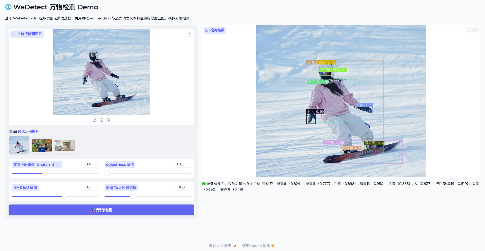
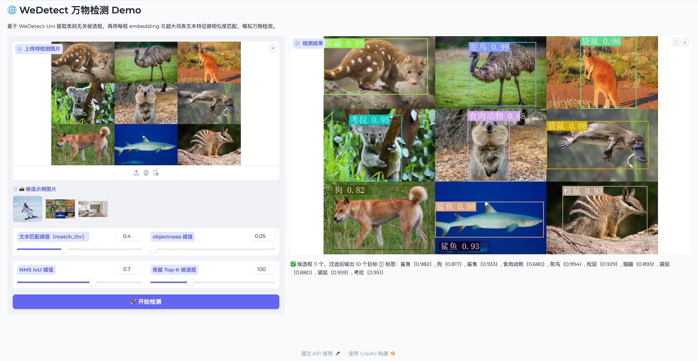
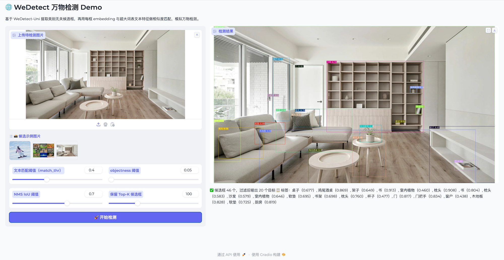

# WeDetect-Anything

基于 **WeDetect-Uni** 的「万物检测」（detect-anything）流水线。

核心思路：先用视觉塔提取**类别无关**的前景候选框（每个框带有一个 box embedding 和一个 box），
再把每个 box embedding 与一个**预先编码好的超大词表文本特征**做相似度匹配，从而在不需要文本输入的前提下，模拟对任意类别的开放词表检测。

```
图像 ──► 候选框 ONNX ──► objectness NMS (top-k) ──► box embedding × 文本特征 ──► sigmoid + argmax ──► 类别 / 框
（仅图像输入）         （类别无关）                 （prompt_free.npy 超大词表）
```

候选阶段是**纯视觉**的：模型内部一组可学习的 prompt embedding（`num_prompts=256`）充当通用
「objectness」提示，因此导出的 ONNX 只接收一张图像，输出候选框、objectness 以及每个框的 embedding。

---

## 目录结构

| 文件 | 说明 |
| --- | --- |
| `models.py` | 自包含的模型定义（不依赖 mmcv/mmdet）：ConvNeXt 主干、CSPRepBiFPAN 颈、YOLO-World 头、XLM-RoBERTa 文本塔、候选检测器与 ONNX 导出包装类，以及权重加载工具。所有脚本共享。 |
| `generate_class_embedding.py` | 把 `prompt_free_vocab.py` 中的超大词表编码为文本特征，保存为 `prompt_free.npy`。 |
| `export_onnx.py` | 把 WeDetect-Uni 候选模型导出为 ONNX，并写出 `*_meta.json`（每层对比常数 + 网格大小）。 |
| `infer_anything.py` | ONNX 推理脚本（预处理 → 候选 → NMS → 文本匹配 → 绘制中文标签）。 |
| `wedetect_unified_app.py` | Gradio 可视化 Demo，复用 `infer_anything.py` 的核心逻辑，保证 CLI 与 UI 行为一致。 |
| `prompt_free_vocab.py` | 预设超大词表 `prompt_free_name`（数千个中文类目）。 |
| `prompt_free.npy` | 预编码文本特征（float32，L2 归一化，`[vocab_size, 768]`），行序与 `prompt_free_name` 一一对应。 |
| `examples/` | 示例图片。 |

---

## 环境依赖

```bash
pip install torch torchvision transformers onnx onnxruntime opencv-python pillow numpy
# 可选：导出时简化计算图
pip install onnxsim
# 可选：运行 Gradio Demo
pip install gradio
```

XLM-RoBERTa 模型目录（项目根的 `xlm-roberta-base/` 或 `xlm-roberta-large/`）用于文本编码。

---

## 使用流程

### 1. 编码超大词表 → `prompt_free.npy`

读取 WeDetect checkpoint 中的文本塔权重，把 `prompt_free_name` 逐批编码并 L2 归一化后保存。

```bash
python wedetect_anything/generate_class_embedding.py \
    --checkpoint checkpoints/wedetect_base.pth \
    --language-model xlm-roberta-base \
    --output wedetect_anything/prompt_free.npy \
    --batch-size 80 \
    --device cuda
```

输出：`prompt_free.npy`，形状 `[vocab_size, 768]`，dtype `float32`，已 L2 归一化。

### 2. 导出候选模型 → ONNX

```bash
python wedetect_anything/export_onnx.py \
    --variant base \
    --checkpoint checkpoints/wedetect_base_uni.pth \
    --img-size 640 \
    --output-dir wedetect_anything/onnx_models \
    --simplify
```

会生成两个文件：

- `wedetect_anything_base.onnx` —— 候选模型，签名如下：

  | 张量 | 形状 | 说明 |
  | --- | --- | --- |
  | `input_image` | `[1, 3, H, W]` | RGB，已除以 255（letterbox 空间） |
  | `scores` | `[1, N, num_prompts]` | objectness，**已 sigmoid** |
  | `bboxes` | `[1, N, 4]` | 解码后的 xyxy（letterbox 空间，DFL 解码已内置） |
  | `embeds` | `[1, N, 768]` | 每个框的（BN 归一化）embedding |

  其中 640 输入时 `N = 80² + 40² + 20² = 8400`。

- `wedetect_anything_base_meta.json` —— 保存每层对比常数 `logit_scale.exp()` / `bias` 与每层网格大小
  `grid_size`。这些常数在推理阶段被精确复用，用于把 box embedding 与文本特征打分：

  ```
  logit = scale_lvl * <txt_feat, box_embed> + bias_lvl
  ```

> 大模型（`--variant large`）请使用 `--img-size 1280` 与 checkpoint 对齐。

### 3. 命令行推理

```bash
python wedetect_anything/infer_anything.py \
    --onnx  wedetect_anything/onnx_models/wedetect_anything_base.onnx \
    --meta  wedetect_anything/onnx_models/wedetect_anything_base_meta.json \
    --text-feat wedetect_anything/prompt_free.npy \
    --image wedetect_anything/examples/1.jpg \
    --output pred.jpg \
    --score-thr 0.1 --iou-thr 0.7 --keep-top-k 100 --match-thr 0.4
```

主要参数：

| 参数 | 默认值 | 说明 |
| --- | --- | --- |
| `--score-thr` | 0.1 | NMS 前的 objectness 阈值 |
| `--iou-thr` | 0.7 | NMS IoU 阈值 |
| `--keep-top-k` | 100 | NMS 后保留的候选框上限 |
| `--match-thr` | 0.4 | 文本匹配 sigmoid 阈值，低于则不打标签 |
| `--font` | `../simsun.ttc` | 中文字体（用于绘制中文类名） |

> 未提供 `--meta` 时，脚本会回退到内置的 base 默认常数（`_DEFAULT_META`）以保持向后兼容。

### 4. Gradio Demo

```bash
cd wedetect_anything
python wedetect_unified_app.py
```

路径通过环境变量配置（默认相对 `wedetect_anything/` 目录）：

| 环境变量 | 默认值 |
| --- | --- |
| `WEDETECT_ONNX` | `onnx_models/wedetect_anything_base.onnx` |
| `WEDETECT_META` | `onnx_models/wedetect_anything_base_meta.json` |
| `WEDETECT_TEXT_FEAT` | `prompt_free.npy` |
| `WEDETECT_FONT` | `../simsun.ttc` |
| `WEDETECT_IMG_SIZE` | `640` |

UI 提供 `match_thr` / `score_thr` / `iou_thr` / `keep_top_k` 滑条，行为与 CLI 完全一致。

<p align="left">
    
</p>

<p align="left">
    
</p>

<p align="left">
    
</p>
